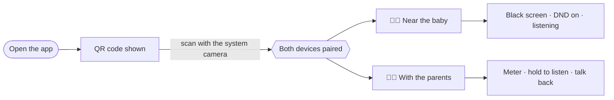
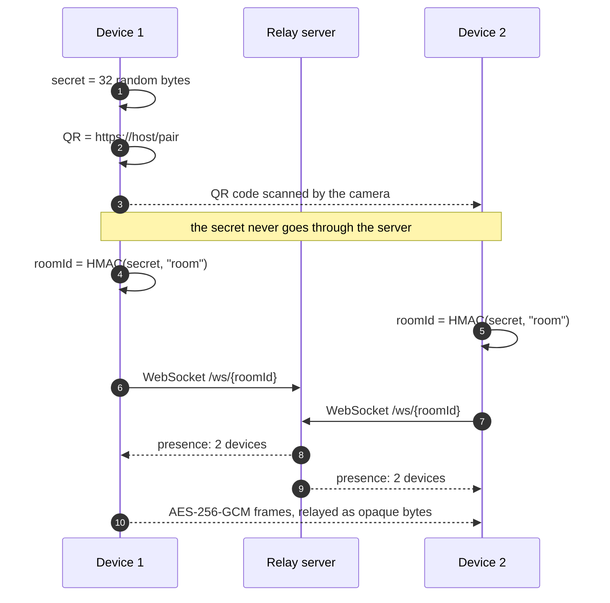
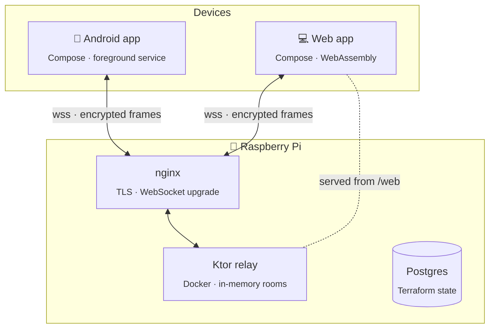
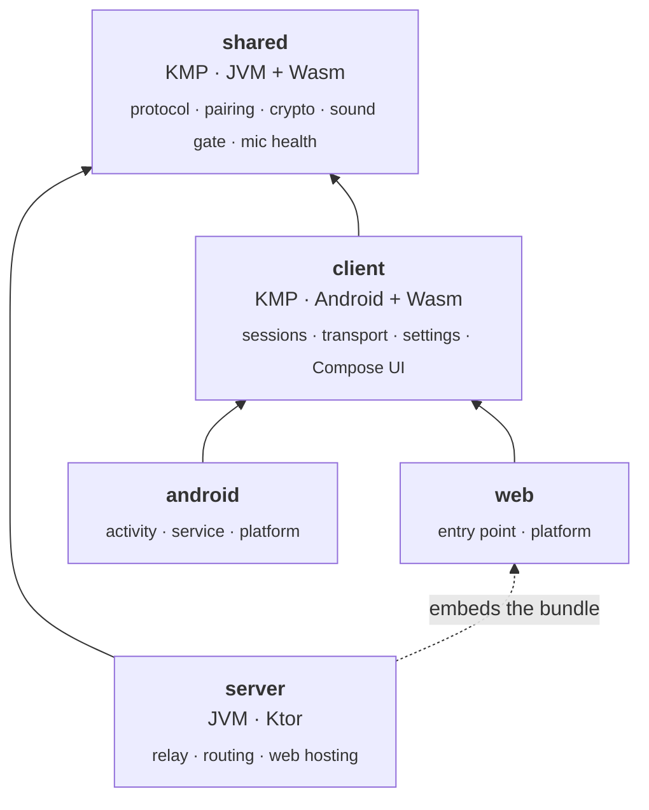
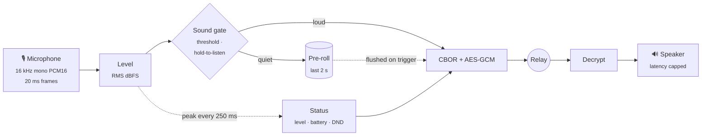
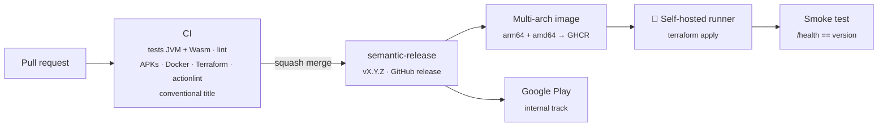

<div align="center">

# 🌙 Baby Phone

**A private, end-to-end encrypted baby monitor for any Android phone or computer,<br>written entirely in Kotlin — from the WebAssembly frontend to the Raspberry Pi it runs on.**

[](https://github.com/Plokkke/baby-phone/actions/workflows/release.yml)


</div>

Two old phones, or a phone and a laptop, become a baby monitor in one QR code scan.
The server that connects them relays encrypted bytes it cannot read, stores nothing, and forgets everything when the night ends.

---

## Contents

- [Features](#features)
- [The user flow](#the-user-flow)
- [Architecture](#architecture)
- [Privacy & security](#privacy--security)
- [Audio pipeline](#audio-pipeline)
- [Reliability](#reliability)
- [Platforms](#platforms)
- [Delivery & infrastructure](#delivery--infrastructure)
- [Quality](#quality)
- [Getting started](#getting-started)
- [Repository layout](#repository-layout)

---

## Features

### 🔗 Pairing
- **One scan.** The first device shows a QR code; the other scans it with the **system camera** (verified Android App Links open the app directly) or with the in-app scanner.
- **As many parents as needed.** Any paired device can show the code again to add another receiver.
- **Works from a computer.** A desktop browser shows the QR to be scanned, and can scan phones with its webcam.
- **Smart entry point.** `babyphone.crn-tech.fr` opens the web app on a computer, the Android app on a phone — or the Play Store when it is not installed.
- **Reset anytime.** Rotating the pairing secret instantly disconnects every other device.

### 👶 Baby side (emitter)
- Sound-triggered transmission with an adjustable **threshold** (set remotely by the parents).
- **2 s pre-roll** and **5 s hangover**: the start of a cry is never lost, short pauses do not cut sentences.
- **Do-not-disturb** enabled automatically, with an in-app switch (no digging through system settings).
- **Night screen**: black, dimmed to the minimum, stopped only by a long press.
- Local **microphone check**: live level and a clear warning when the microphone is blocked or muted by the system.
- Survives the screen being off: foreground service, wake lock, low-latency Wi-Fi lock.

### 👥 Parent side (receiver)
- **Live level meter** with the trigger threshold, "Quiet" / "Sound detected" at a glance.
- **Hold to listen live**, bypassing the threshold only while pressed.
- **Talk back** to the baby, time-boxed and impossible to forget (the whole screen turns red).
- **Status of the baby's phone**: online, battery level and charging, do-not-disturb active or not.
- **Audibility check**: media and alarm volumes, total-silence mode, disabled notifications — with one-tap fixes.

### 🚨 Safety nets
- **Lost-link alarm**: looping alarm sound, vibration and a high-priority notification, even with the app in the background. It arms itself once the baby's phone has been heard, so starting the parents first never rings.
- **Automatic reconnection** of every device, forever, every 2 s.
- **Remote threshold** always reflects what the baby's phone actually applies.

## The user flow



Three taps, no account, no typing. Behind the scan:



## Architecture



### One codebase, every device

The whole behaviour of a device — sessions, transport, settings, screens — is written **once**, in common Kotlin.
Android and the browser only plug in what is truly theirs.



`client` has **no `expect`/`actual`**: platforms implement three small contracts.

| Contract | Android | Browser |
|---|---|---|
| `Microphone` | `AudioRecord` (raw for monitoring, voice-processed for talk-back) | `getUserMedia` → `AudioWorklet` resampling to 16 kHz |
| `Speaker` | `AudioTrack`, non-blocking | Scheduled `AudioBuffer`s |
| `Alarm` | Alarm ringtone, vibration, notification | Web Audio beeps, system notification |
| `QuietMode` | `NotificationManager` interruption filter | — (a page cannot touch the OS) |
| `SoundOutput` | Media/alarm volumes, DND, notification state | Autoplay state, notification permission, test chime |
| `Battery` | `BatteryManager` | Battery Status API |
| `KeyValueStorage` | `SharedPreferences` | `localStorage` |
| `MonitorController` | Foreground service | The tab, kept awake by a Wake Lock |
| `PlatformUi` | ML Kit scanner, runtime permissions, screen dimming | Webcam scanner (`BarcodeDetector`, jsQR fallback) |

### Technical choices

| Choice | Why |
|---|---|
| **Kotlin everywhere** | One language from the relay to the UI: the protocol is literally the same code on both ends. |
| **Kotlin Multiplatform + Compose Multiplatform** | The browser is a first-class device, not a port; no logic is written twice. |
| **WebSocket relay** rather than WebRTC | Works through any NAT, easy to reason about and to debug; the relay core is ~130 lines. |
| **Relay as a dumb pipe** | The server routes by role and never parses peer messages: nothing to leak, nothing to migrate. |
| **CBOR over AES-GCM** | Compact binary framing for audio, authenticated encryption, tolerant decoding of unknown fields. |
| **`cryptography-kotlin`** | Same API over the JDK on Android and Web Crypto in browsers. |
| **PCM 16 kHz** | Audio is only sent when the room is loud; simplicity and zero codec latency win. |
| **Manual dependency injection** | Two containers, no framework: the wiring is readable in one file. |
| **Terraform + Docker provider** | The Pi is managed declaratively through its Docker API, no agent, no SSH scripts. |

## Privacy & security

**The relay is untrusted by design.** It moves bytes between devices; it never holds the means to understand them.

| | What the server sees | What it never sees |
|---|---|---|
| Pairing | A room id: `HMAC-SHA256(secret, "room")` | The secret, which lives in the URL **fragment** (never sent over HTTP) |
| Audio | Encrypted frames, their size and timing | Any sample or level |
| Controls | Small encrypted frames and their direction | Which command, which threshold |
| Devices | A random device id, model name and role (for presence) | Accounts, phone numbers, locations |
| Storage | — | Everything: rooms live in memory and disappear with their last device |

Because transmission is sound-triggered, traffic *timing* tells the relay when the room is loud — never what is heard.
Hosting the relay yourself (as this project does on a Raspberry Pi) keeps even that metadata at home.

**Cryptography**
- 256-bit pairing secret from a CSPRNG; keys derived with HMAC-SHA256 and domain separation (`"room"`, `"aes-gcm"`).
- Every peer message is **AES-256-GCM** with a fresh random 96-bit nonce: confidentiality **and** integrity. Frames from another pairing, or tampered with, are dropped.
- The derivation is pinned by a **reference test vector** computed outside Kotlin, so every version and platform meets in the same room.

**Hygiene**
- No analytics or tracking SDK, no logs of audio or room contents; the WebSocket path is excluded from nginx access logs.
- Android backups and device transfers **exclude** the pairing secret and device id.
- Pairing links opened in a browser are **wiped from the address bar** once consumed.
- Only verified App Links (`assetlinks.json` with the signing certificates) can open pairing URLs in the app.
- The public repository's CI never runs untrusted code on the Pi: PR workflows use GitHub-hosted runners, fork runs need approval, and the `production` environment only deploys from `main`.

## Audio pipeline



| Parameter | Value | Reason |
|---|---|---|
| Format | 16 kHz · mono · 16-bit · 20 ms frames | Speech and cries fit well under 8 kHz |
| Pre-roll / hangover | 2 s / 5 s | Never cut the first cry, never chop a sentence |
| Status heartbeat | every 250 ms | Smooth level meter, fast failure detection |
| Lost-link alarm | 10 s without status | Tolerates a Wi-Fi hiccup, not a dead phone |
| Hold to listen | keep-alive 500 ms, expires after 1.5 s | Releasing the finger or losing the link closes the gate |
| Talk-back | 60 s maximum, 300 ms echo guard | Never left open by mistake; no feedback loop |
| Playback latency | capped at 0.5 s | Late audio is dropped rather than queued |

## Reliability

- **Heartbeat-driven alarm**: silence and failure look the same on the wire, so the emitter always talks, even when the room is quiet.
- **Backpressure everywhere**: every queue is bounded and drops the *oldest* frames — stale audio is worthless, and one slow receiver never delays the others.
- **Self-healing links**: WebSocket ping every 5 s, reconnection every 2 s, a reconnecting device replaces its previous session.
- **Background survival on Android**: typed foreground service (microphone / media playback), partial wake lock, low-latency Wi-Fi lock.
- **Honest diagnostics**: blocked microphone, digital silence, low volume, total-silence mode and disabled notifications are all surfaced in the UI.

## Platforms

| Capability | Android | Computer (browser) |
|---|:---:|:---:|
| Emitter / receiver | ✅ / ✅ | ✅ / ✅ |
| Show / scan pairing QR | ✅ / ✅ system camera & in-app | ✅ / ✅ webcam |
| Talk back · hold to listen | ✅ | ✅ |
| Lost-link alarm in background | ✅ alarm + notification | ✅ beeps + notification |
| Do-not-disturb control | ✅ in-app switch | — OS-level, out of a page's reach |
| Volume check | ✅ media & alarm volumes | Autoplay & notification checks, test chime |
| Stays alive screen off | ✅ foreground service | Tab open, screen Wake Lock |

Mobile browsers are redirected to the app: a phone is always a better baby monitor natively.

## Delivery & infrastructure



- **Every PR** is validated on GitHub-hosted runners; its title follows Conventional Commits because it becomes the squash commit.
- **Every merge** to `main` that contains a `feat`, `fix` or `perf` is released with a semantic version and deployed.
- The fat jar is built **once** (architecture-independent) and wrapped into an arm64 image without emulated compilation; it embeds the web client.
- **Terraform** manages the container on the Raspberry Pi through the Docker API, from a runner living on the Pi itself — no inbound port, no SSH.
- Terraform state lives in a **Postgres** backend on the Pi, one schema per stack.
- A second Terraform stack provisions the **Google Play** publisher (API, service account, GitHub secret); Gradle Play Publisher uploads signed bundles to the internal track.
- Versions flow from the tag into the APK (`versionName`, monotonic `versionCode`) and into the server (`/health`).

## Quality

- **Shared logic is tested on both runtimes**: the 21 tests of `shared` run on the JVM *and* in WebAssembly — protocol, crypto, pairing links, loudness, sound gate, microphone health.
- **Relay integration tests** open real WebSockets: role routing, room isolation, presence, device-aware routing, compressed and cached web bundle.
- **Static checks** in CI: Android lint, `terraform fmt`/`validate`, `actionlint`, a secret scanner on every PR.
- **Locked dependencies**: Gradle version catalog, Terraform provider locks for three platforms, Yarn lock for the web toolchain.

## Getting started

```bash
./gradlew :shared:allTests :server:test      # tests on JVM + Wasm, relay integration tests
./gradlew :server:run                         # relay on :8080, web client on http://localhost:8080/web/
./gradlew :android:installDebug               # Android app on a USB-connected phone
```

Requirements: JDK 21 and an Android SDK (`local.properties` → `sdk.dir`). The public URL is configured once, in `gradle.properties` (`babyphone.publicUrl`): QR links, App Links and the WebSocket endpoint all derive from it.

<details>
<summary><b>Server configuration</b></summary>

| Variable | Default | Purpose |
|---|---|---|
| `PORT` | `8080` | HTTP port |
| `APP_VERSION` | `dev` | Reported by `/health` |
| `ANDROID_PACKAGE` | `fr.crntech.babyphone` | App Links target |
| `ANDROID_CERT_SHA256` | — | Comma-separated signing certificate fingerprints |
| `PLAY_STORE_URL` | — | Where phones without the app are sent |
| `MAX_MEMBERS_PER_ROOM` | `8` | Devices per pairing |

</details>

<details>
<summary><b>Deployment</b></summary>

One-time setup of the Raspberry Pi (state database, runner, nginx) in [`knowledge/delivery.md`](knowledge/delivery.md), Play Store onboarding in [`knowledge/play-store.md`](knowledge/play-store.md), design notes in [`knowledge/architecture.md`](knowledge/architecture.md).

</details>

## Repository layout

```
components/
├── shared/      Kotlin Multiplatform (JVM + Wasm): protocol, pairing, crypto, sound gate, microphone health
├── server/      Ktor relay: rooms, role routing, device-aware entry points, web hosting
├── client/      Kotlin Multiplatform (Android + Wasm): sessions, transport, settings, Compose UI
├── android/     Android shell: activity, foreground service, platform implementations
└── web/         Browser shell: Wasm entry point, Web Audio, webcam scanner
infrastructure/
├── docker/      Runtime image
├── terraform/   server (Docker on the Pi) · play (Google Play publisher)
├── bootstrap/   Terraform state database
└── nginx/       Reverse proxy site
knowledge/       Architecture, delivery and Play Store notes
.github/         CI, release and deployment workflows
```

| Stack | |
|---|---|
| Language | Kotlin 2.4 |
| UI | Compose Multiplatform 1.12 · Material 3 |
| Server | Ktor 3.6 · Netty · kotlinx.serialization (JSON, CBOR) |
| Crypto | cryptography-kotlin (JDK · Web Crypto) |
| Android | AGP 9.4 · minSdk 29 · targetSdk 37 |
| Build | Gradle 9.8 · version catalog |
| Infra | Docker · Terraform 1.16 · nginx · Raspberry Pi · GitHub Actions |
